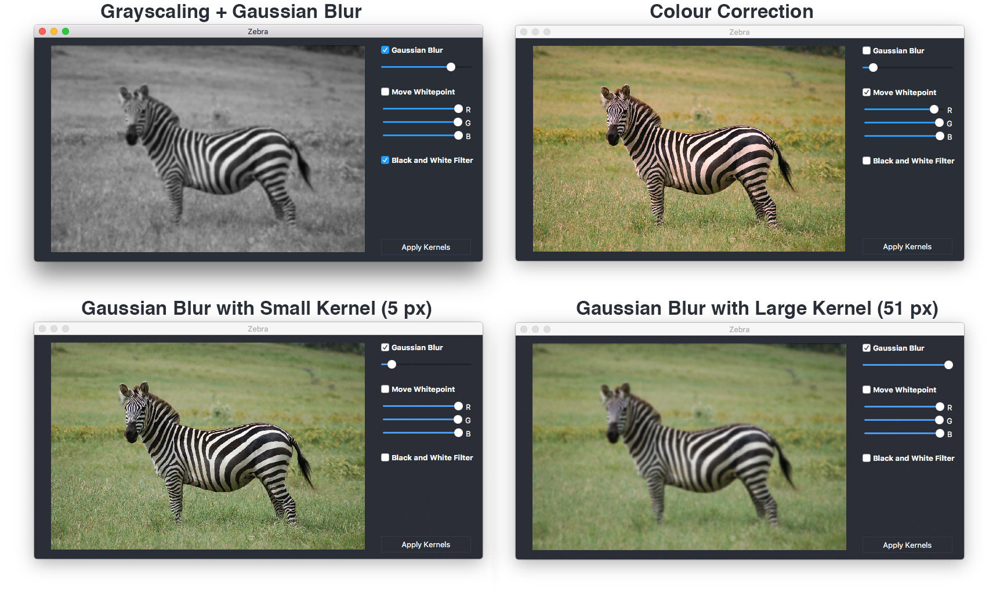
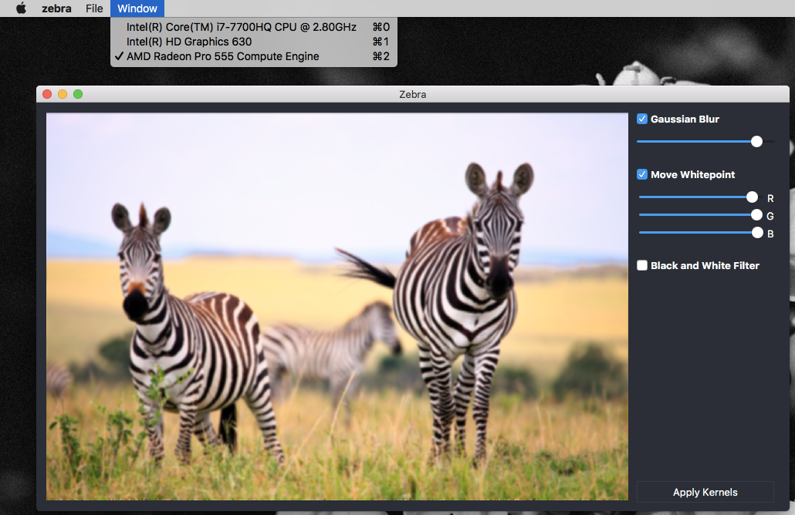

# Advanced computer architectures: CUDA and openCL
This repository contains the lab reports (in Dutch) and source of a simple photo editor, called Zebra. 

## Purpose
This was developed for the lab associated with a course on advanced computer architectures.

# Zebra
Zebra is a small, OpenCL based photo editor. It can load images in jpg, png and some other formats. It then displays the image and allows the user to select different effects, like grayscaling or gaussian blurring. These effects can be executed in a pipeline-like fassion. 

## OpenCL
Zebra is built around OpenCL, a computing API for GPU's and other hardware accelerators. The software automatically detects all OpenCL-enabled devices and lists them; allowing the user to select one or multiple. The purpose of this selection is to compare different devices (GPU vs CPU for example).

